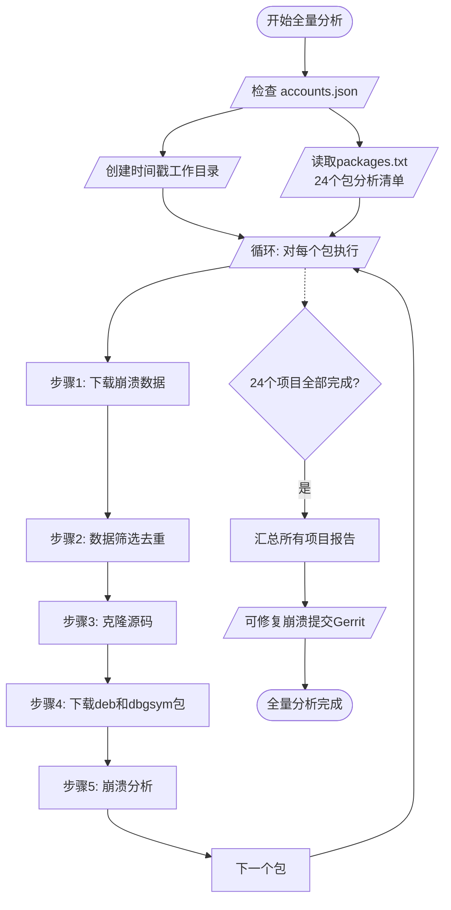
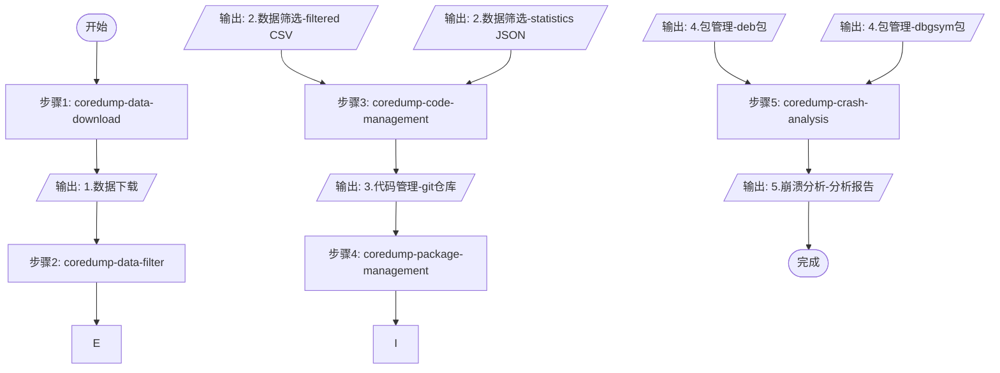
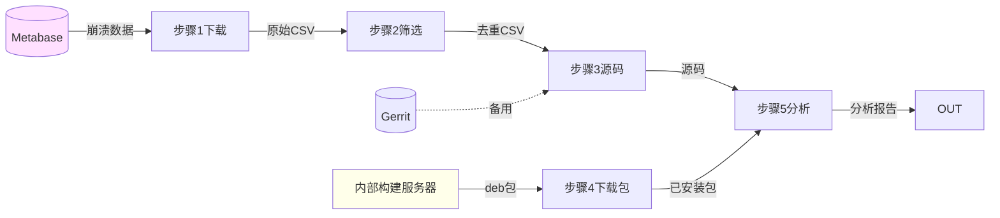
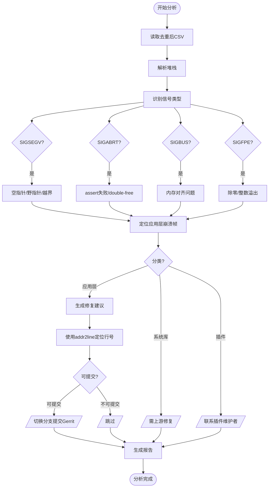
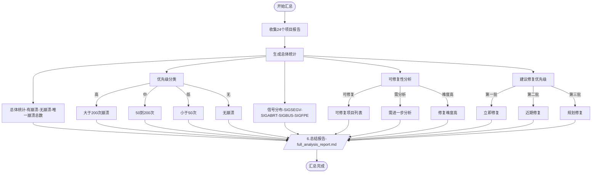
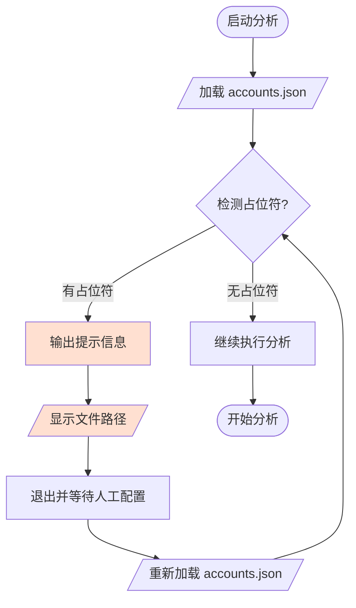

# 全量崩溃分析完整流程

## 一、整体架构



---

## 二、单项目分析详细流程



---

## 三、步骤1~5数据流向



---

## 四、崩溃分析内部流程



---

## 五、全量汇总报告结构



---

## 六、工作目录结构

```
~/coredump-workspace-YYYYMMDD-HHMMSS/
  1.数据下载/
    download_YYYYMMDD-HHMMSS/
      <package>_X86_crash_YYYYMMDD-HHMMSS.csv
  2.数据筛选/
    filtered_<package>_crash_data.csv
    <package>_crash_statistics.json
  3.代码管理/
    <package>/               (git仓库)
  4.包管理/
    downloads/
      <package>_<ver>_amd64.deb
      <package>-dbgsym_<ver>_amd64.deb
  5.崩溃分析/
    <package>_crash_analysis_report.md
  6.修复补丁/
  6.总结报告/
    full_analysis_report.md
```

---

## 七、账号检查流程



---

## 八、Git提交格式

```text
fix/feat/chore: 提交信息说明

崩溃信息:
- 崩溃版本: <version>
- 架构: <arch>
- 修复详细堆栈:
<full_stack_trace>

本次修复说明:
<fix_description>

Log: 基于产品说明本次修复内容
Influence: 影响哪些功能点
```
