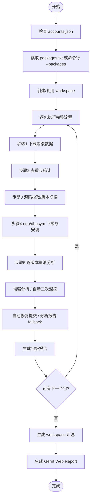
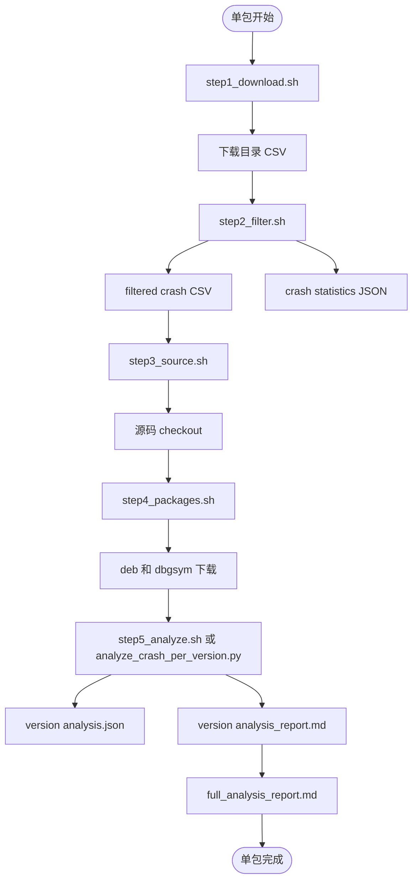
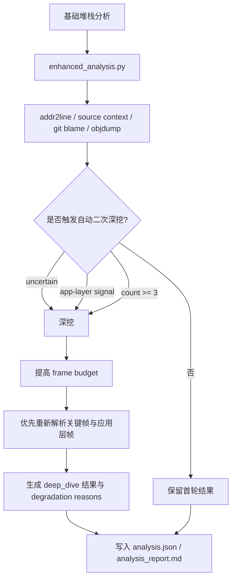
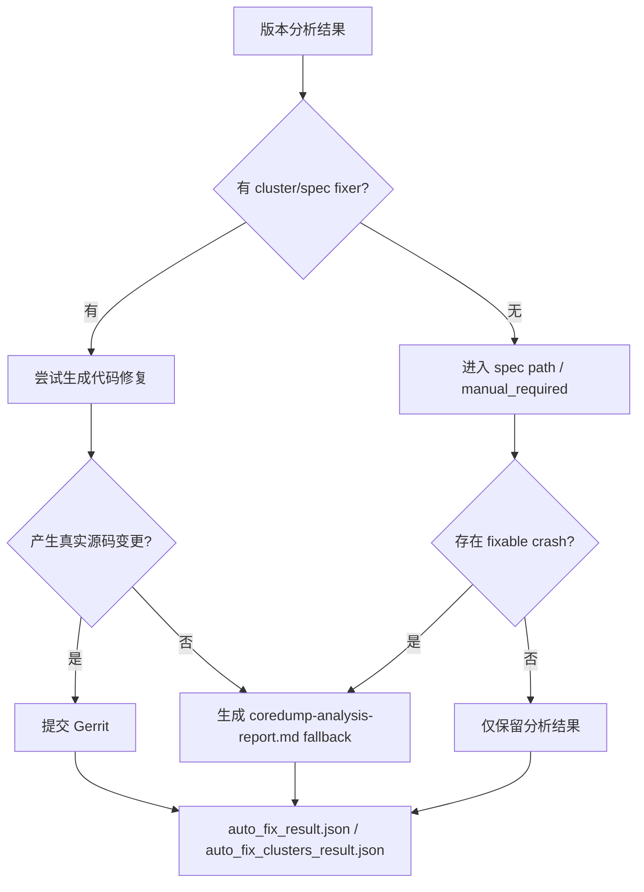

# 全量崩溃分析当前流程图

本文描述 `coredump-analysis-skills` 当前主链路，而不是历史专项脚本。

约定：
- 默认项目清单来自仓库根目录 `packages.txt`
- 当前 `packages.txt` 启用了 24 个默认项目，全量分析默认按这 24 个项目执行
- 当前主入口是 `run_analysis_agent.sh` 和 `coredump-full-analysis/scripts/analyze_crash_complete.sh`
- `coredump-full-analysis/scripts/analyze_dde_launcher_*.sh`、`analyze_all_versions.sh` 等属于 legacy，不再作为主链路维护

## 一、总体架构



## 二、单包主链路



## 三、增强分析与自动二次深挖



当前默认规则：
- `--max-crashes 0`：单版本默认分析全部去重后的 crash
- `--addr2line-max-frames 300`
- 自动二次深挖至少扩展到 `600` 帧
- 深挖触发条件：`fixable == 'uncertain'` / app-layer signal / `count >= 3`

## 四、自动修复提交与报告 fallback



说明：
- “真实修复提交”和“分析报告 fallback 提交”必须区分
- Gerrit Web Report 是辅助汇总，不是自动提交是否成功的唯一真相来源
- 自动修复链路的详细覆盖情况见 `references/fixer-architecture.md`

## 五、workspace 产物

```text
<workspace>/
  1.数据下载/
  2.数据筛选/
  3.代码管理/
  4.包管理/downloads/
  5.崩溃分析/<package>/
    version_*/analysis.json
    version_*/analysis_report.md
    full_analysis_report.md
    AI_analysis_report.md
  6.修复补丁/
  6.总结报告/
    final_conclusion.md
    summary_statistics.json
    package_status.tsv
    version_status.tsv
    gerrit-web-report/index.html
    logs/analysis_<pkg>.log
```

## 六、当前推荐入口

1. 多包/全量：
```bash
bash run_analysis_agent.sh --background --progress 180
```

2. 单包完整流程：
```bash
bash coredump-full-analysis/scripts/analyze_crash_complete.sh --package <package>
```

3. 仅在排查或恢复时使用分步脚本：
- `step1_download.sh`
- `step2_filter.sh`
- `step3_source.sh`
- `step4_packages.sh`
- `step5_analyze.sh`

## 七、不要再把这些当作主链路

以下脚本仅为历史兼容/对照保留：
- `analyze_dde_launcher_auto.sh`
- `analyze_dde_launcher_full.sh`
- `analyze_all_versions.sh`
- `auto_analysis.sh`
- `analyze_and_fix.sh`
- `auto_analyze_and_fix.sh`

如需理解历史原因，请看：
- `coredump-full-analysis/scripts/LEGACY.md`
